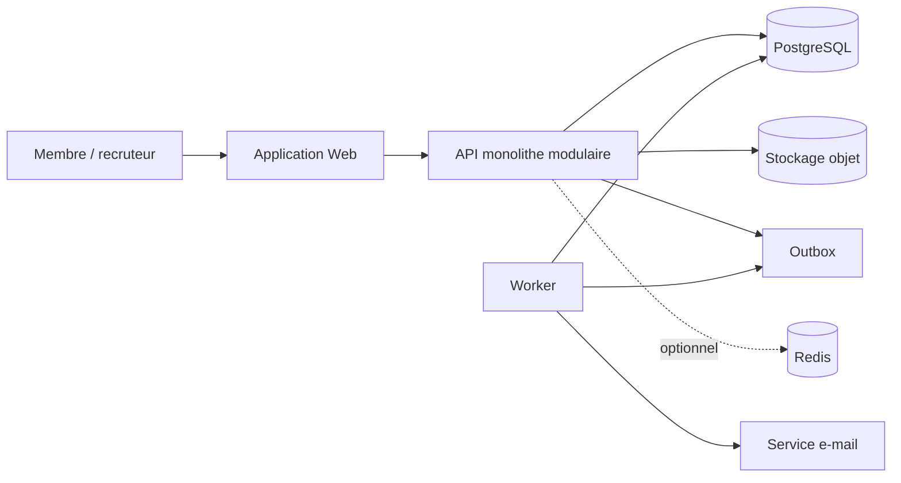
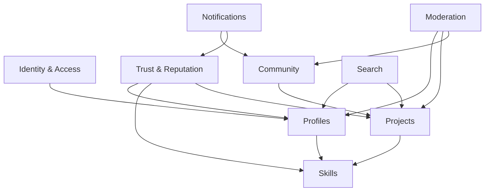

# Architecture applicative

## Décision générale

Vertech démarre comme un **monolithe modulaire** exposant une API HTTP et
utilisant PostgreSQL comme source de vérité. Le frontend peut être livré dans
le même déploiement ou séparément sans modifier les frontières métier.

La stack de référence proposée est :

- frontend : Next.js + TypeScript ;
- backend : API Next.js ou NestJS + TypeScript ;
- données : PostgreSQL 16+ ;
- accès aux données : Prisma ou Drizzle, à décider lors du bootstrap ;
- fichiers : stockage objet compatible S3 ;
- tâches asynchrones MVP : table d’outbox + worker ;
- cache et limitation de débit : Redis uniquement quand le besoin apparaît ;
- observabilité : logs structurés, métriques et suivi d’erreurs.

Cette stack est une recommandation, pas une dépendance de la conception
MERISE. Le schéma SQL reste utilisable depuis une autre technologie.

## Vue conteneurs

## Modules métier

| Module | Responsabilité | Ne doit pas faire |
|---|---|---|
| Identity | Authentification, rôles, statut du compte | Gérer le contenu du profil |
| Profiles | Identité publique, disponibilité, liens | Calculer la réputation |
| Skills | Référentiel et compétences déclarées | Valider socialement une compétence |
| Projects | Projets, preuves, médias, contributeurs | Déterminer seul un score |
| Community | Groupes, posts, commentaires, réactions | Authentifier les comptes |
| Trust | Validations, recommandations, journal et scores | Modifier une preuve source |
| Search | Indexation et filtres de découverte | Être source de vérité |
| Notifications | Préférences et livraison | Porter des règles métier |
| Moderation | Signalements, décisions et audit | Effacer l’historique sans trace |

## Flux d’écriture

1. Le contrôleur authentifie et valide la requête.
2. Le service applicatif applique les règles métier.
3. Une transaction écrit l’état métier et un événement d’outbox.
4. La réponse HTTP est retournée.
5. Le worker traite notifications, indexation et recalculs idempotents.

Cette approche évite de perdre un événement entre la validation de la
transaction et l’appel à un service externe.

## Recherche

Pour le MVP :

- recherche plein texte PostgreSQL sur profils et projets ;
- index B-tree pour pays, ville, disponibilité et statut ;
- jointures indexées pour compétences ;
- tri par pertinence, activité récente et réputation.

Un moteur externe ne devient pertinent qu’après mesure de limites concrètes
(latence, fautes de frappe, facettes complexes ou volume important).

## Sécurité

- mots de passe hachés avec Argon2id ou authentification déléguée ;
- contrôle d’accès au niveau du service, jamais seulement dans l’interface ;
- validation stricte des entrées et limites de taille ;
- URL signées pour l’upload direct vers le stockage objet ;
- protection CSRF si cookies de session, cookies `HttpOnly`, `Secure`,
  `SameSite=Lax` ou plus strict ;
- limitation de débit sur connexion, commentaires, validations et recherche ;
- journal d’audit pour suspension, modération et changement de score manuel ;
- sauvegardes chiffrées et tests réguliers de restauration ;
- collecte minimale de données personnelles ;
- procédure d’export et de suppression des données.

## Déploiement

Environnements minimaux :

- local : application + PostgreSQL via conteneurs ;
- staging : données fictives, migrations automatiques contrôlées ;
- production : base managée, stockage objet, sauvegardes et supervision.

Les migrations sont versionnées. Une modification destructive se fait en
plusieurs déploiements : ajout compatible, migration des données, bascule du
code, puis suppression ultérieure.

## Objectifs non fonctionnels initiaux

| Objectif | Cible MVP |
|---|---|
| Disponibilité | 99,5 % mensuel |
| Latence API lecture p95 | moins de 500 ms hors média |
| Sauvegarde | quotidienne, rétention 30 jours |
| RPO | 24 heures maximum au lancement |
| RTO | 8 heures maximum au lancement |
| Accessibilité | WCAG 2.1 AA sur parcours principaux |
| Journalisation | requête, acteur, erreur, durée, corrélation |

## Évolution

Extraire un service uniquement si une frontière présente simultanément une
charge indépendante, un besoin de disponibilité distinct et une équipe capable
de l’opérer. Les premiers candidats possibles sont notifications, recherche et
traitement des médias, pas le cœur transactionnel de réputation.
