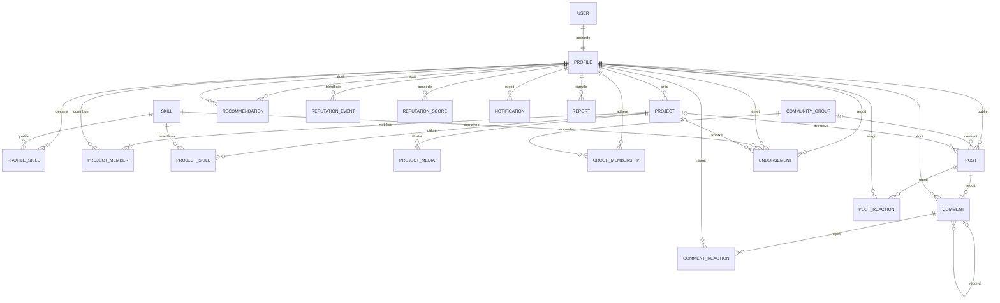

# Modèle conceptuel de données — MCD

## Diagramme principal

## Cardinalités structurantes

| Association | Cardinalité | Justification |
|---|---|---|
| USER — PROFILE | 1,1 — 1,1 | Tout compte applicatif représente un membre |
| PROFILE — SKILL | 0,n — 0,n | Un talent et une compétence sont indépendants |
| PROFILE — PROJECT | 0,n — 1,1 | Tout projet a un créateur responsable |
| PROJECT — PROFILE | 1,n — 0,n | Un projet peut avoir plusieurs contributeurs |
| GROUP — PROFILE | 0,n — 0,n | Adhésion avec rôle et statut |
| GROUP — POST | 0,n — 0,1 | Un post global n’appartient à aucun groupe |
| POST — COMMENT | 0,n — 1,1 | Tout commentaire cible un post |
| PROFILE — ENDORSEMENT | 0,n — 1,1 | L’émetteur et le bénéficiaire sont obligatoires |
| SKILL — ENDORSEMENT | 0,n — 1,1 | Toute validation concerne une compétence |
| PROFILE — REPUTATION_EVENT | 0,n — 1,1 | Chaque signal bénéficie à un profil |

## Contraintes non représentables par les cardinalités

- l’émetteur d’une validation diffère de son bénéficiaire ;
- l’auteur d’une recommandation diffère de son bénéficiaire ;
- un propriétaire de projet est aussi présent dans `PROJECT_MEMBER` ;
- une réaction ne peut exister qu’une fois par type, acteur et cible ;
- un score agrégé est dérivé des événements, jamais l’inverse ;
- un contenu privé n’est accessible qu’aux acteurs autorisés ;
- une preuve référencée par un événement doit exister au moment de l’émission.
