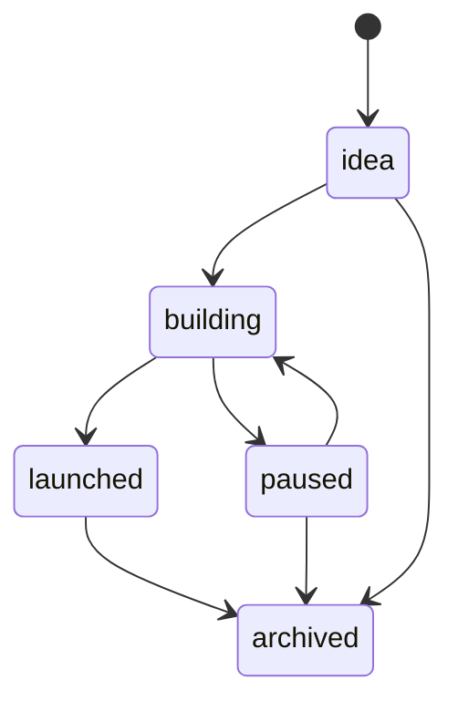
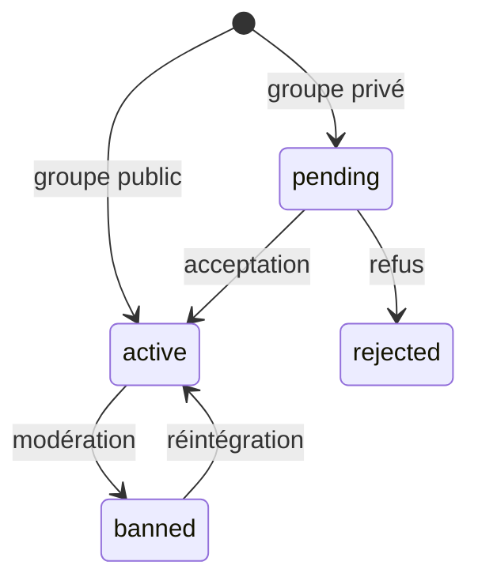
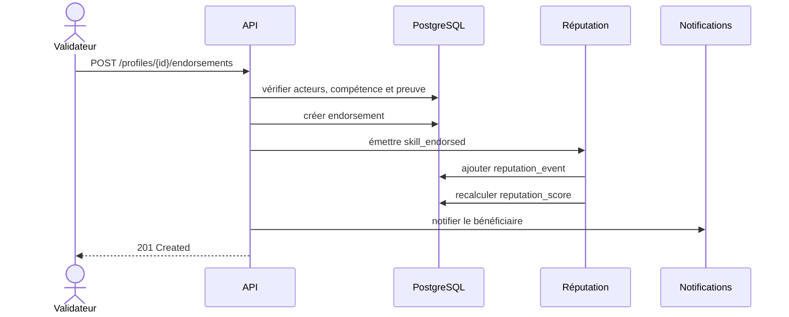

# Modèles conceptuel et organisationnel des traitements

## MCT — événements et opérations

| Événement | Conditions | Opération | Résultat |
|---|---|---|---|
| Inscription demandée | E-mail valide et absent | Créer compte et profil minimal | Compte en attente de vérification |
| E-mail vérifié | Jeton valide | Activer le compte | Membre autorisé à contribuer |
| Profil complété | Champs obligatoires présents | Publier le profil | Profil indexable |
| Projet soumis | Auteur actif, données valides | Créer projet et propriétaire | Projet visible selon sa visibilité |
| Contribution ajoutée | Gestionnaire du projet | Associer un membre | Contribution traçable |
| Publication envoyée | Auteur actif et groupe accessible | Enregistrer et diffuser | Feed et notifications mis à jour |
| Compétence validée | Validateur distinct, preuve admissible | Créer validation et événement | Réputation recalculée |
| Recommandation envoyée | Auteur distinct du bénéficiaire | Enregistrer en attente ou publiée | Signal de confiance disponible |
| Contenu signalé | Cible existante | Ouvrir dossier de modération | Signalement assignable |
| Signalement résolu | Modérateur autorisé | Décider et journaliser | Contenu conservé, masqué ou archivé |

## Cycle de publication d’un projet

## Cycle d’une adhésion à un groupe

## MOT — responsabilités et automatisations

| Traitement | Membre | Modérateur | Système | Fréquence |
|---|---:|---:|---:|---|
| Compléter profil | R |  | contrôle validation | à la demande |
| Publier projet | R |  | indexation | à la demande |
| Valider compétence | R |  | anti-auto-validation | à la demande |
| Recalculer réputation |  |  | R | événementiel + tâche nocturne |
| Signaler contenu | R |  | contrôle unicité | à la demande |
| Résoudre signalement |  | R | audit | à la demande |
| Envoyer notifications |  |  | R | asynchrone |
| Purger données expirées |  |  | R | quotidien |
| Sauvegarder la base |  |  | R | quotidien |

`R` indique le responsable de l’action.

## Séquence : validation d’une compétence

